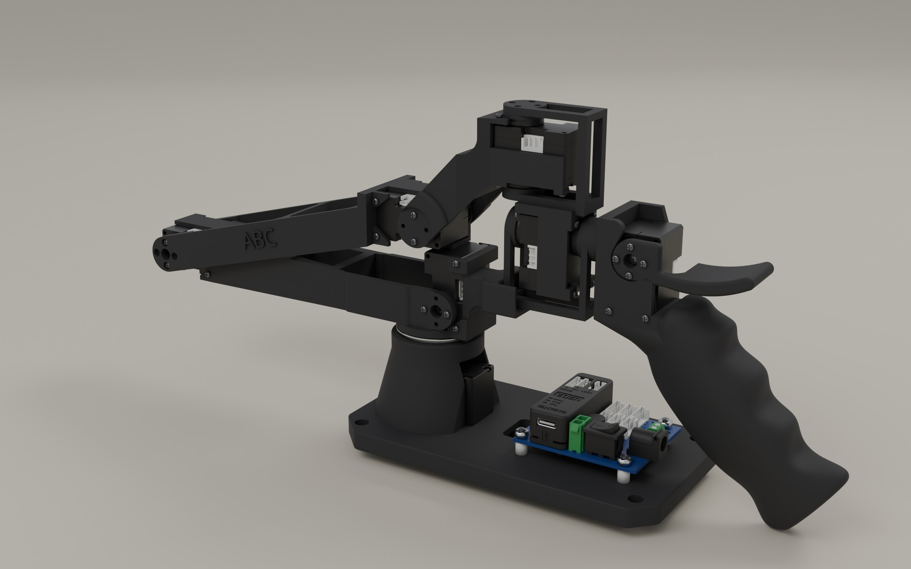

# GELLO

[Assembly guide](GELLO_assembly.pdf)

Print the eight standard parts in `stl/`. For the compact handle, replace only
`stl/6.stl` with [6_compact.stl](variants/compact-handle/6_compact.stl):
20% slimmer and 15% shorter in the free grip, with unchanged mounting geometry.

## Bill of materials

| Item | Quantity | Unit price | Total | Link |
| --- | ---: | ---: | ---: | --- |
| DYNAMIXEL XL330-M077-T | 7 | $27.49 | $192.43 | [Buy](https://www.robotis.us/dynamixel-xl330-m077-t/) |
| FPX330-H101 4-piece set (idler wheels and caps used) | 2 | $10.78 | $21.56 | [Buy](https://www.robotis.us/fpx330-h101-4pcs-set/) |
| U2D2 | 1 | $35.31 | $35.31 | [Buy](https://www.robotis.us/u2d2/) |
| Bearings | 1 | $12.27 | $12.27 | [Buy](https://www.amazon.com/dp/B08HR2JNGJ) |
| M2/M3 screw kit | 1 | $14.99 | $14.99 | [Buy](https://www.amazon.com/dp/B08KXS2MWG?th=1) |
| U2D2 Power Hub Board set | 2 | $21.85 | $43.70 | [Buy](https://www.robotis.us/u2d2-power-hub-board-set/) |
| 5V power supply | 2 | $7.99 | $15.98 | [Buy](https://www.amazon.com/dp/B09W8X9VGK) |
| **Total** | | | **$336.24** | |

Prices are the supplied quote, excluding shipping and tax.

Fasteners used by the assembly guide (two opposite screws per face on two-sided horn/wheel joints):

| Fastener | Used | Supplied with hardware packs | Additional |
| --- | ---: | ---: | --- |
| M2 × 6 mm TAP | 28 | 42 | 0 |
| M2 × 8 mm TAP | 38 | 70 | 0 |
| M2.6 × 6 mm TAP | 5 | 16 | 0 |
| Rear wheels + caps | 5 of each | 8 of each | 0 |
| M3 × 10 mm screws | 4 | Included in the screw kit listed above | 0 |
| Power-hub spacers | 4 | Included with U2D2 Power Hub Board | 0 |

M3 × 10 mm screws come from the screw kit in the BOM; spacers are included
with the power hub. See the assembly guide for per-step screw counts and printing notes.
